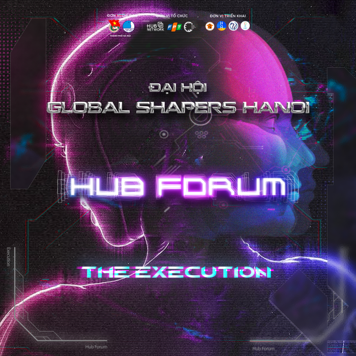
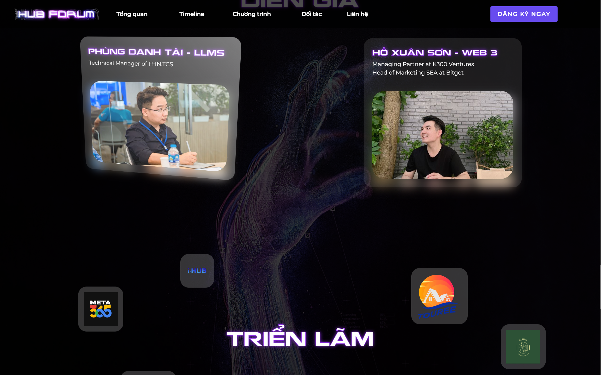

<!-- Improved compatibility of back to top link: See: https://github.com/othneildrew/Best-README-Template/pull/73 -->

<a name="readme-top"></a>


[![Contributors][contributors-shield]][contributors-url]
[![Forks][forks-shield]][forks-url]
[![Stargazers][stars-shield]][stars-url]
[![Issues][issues-shield]][issues-url]
[![MIT License][license-shield]][license-url]
[](https://www.facebook.com/Minhatt048/)

<!-- PROJECT LOGO -->
<br />
<div align="center">
  <a href="https://hubforum.hubglobal.network/">
    
  </a>
  <h2 align="center">
  A Landing page for the HUB FORUM event 
    <br />
    <br />
    
  </h2>
  <p>Try it yourself and accept out invitation <a href="https://hubforum.hubglobal.network/">Hub Forum</a></p>
</div>

<!-- TABLE OF CONTENTS -->
<details>
  <summary>Table of Contents</summary>
  <ol>
    <li>
      <a href="#about-the-project">About Hub Forum</a>
      <ul>
        <li><a href="#built-with">Built With</a></li>
      </ul>
    </li>
    <li><a href="#my-role">My Role</a></li>
    <li><a href="#feature">Feature</a></li>
    <li><a href="#clone-and-installation">Clone And Installation</a></li>
    <li><a href="#license">License</a></li>
    <li><a href="#contact">Contact</a></li>
  </ol>
</details>

<!-- ABOUT THE PROJECT -->

## About The Project
Dưới sự chỉ đạo của Thành Đoàn thành phố Hà Nội  Global Shaper Community phối hợp cùng mạng lưới các clb khởi nghiệp, đổi mới sáng tạo và chuyển đổi số Hub Network và Tập Đoàn FPT đã tổ chức Đại hội đại biểu Câu lạc bộ Kiến tạo Địa cầu, nhiệm kỳ 2023 - 2025 và Hub Forum - The Execution, là sự kiện hướng tới cộng đồng giải quyết các vấn đề xã hội và môi trường. Với mục đích tạo cơ hội để các Doanh nghiệp Xã hội, các chuyên gia và các nhà nghiên cứu lĩnh vực Công nghệ đổi mới sáng tạo được gặp gỡ, giao lưu và trao đổi kiến thức.

<p align="right">(<a href="#readme-top">back to top</a>)</p>

## My Role
- I'm the leader, designer and frontend dev of this project. Throughout the project I have learnt alot about animation and how a landing page supposed to look like. Hope you guys enjoy it and apply for the event
### Built With
-   
-   
-   

<p align="right">(<a href="#readme-top">back to top</a>)</p>

## Feature

**1. Animation onscroll**


**2. Vanilla tilt and glassmorphism**

 

 <p align="right">(<a href="#readme-top">back to top</a>)</p>
<!-- ROADMAP -->

<!-- CONTRIBUTING -->

## Clone And Installation

Clone the project

```bash
  git clone https://github.com/Minhnhat0408/Hub-Forum
```

Go to the project directory

```bash
  cd Hub-Forum
```

Install dependencies

```bash
  npm install
  yarn
```

Start the server

```bash
  npm run dev
  yarn run dev
```

<p align="right">(<a href="#readme-top">back to top</a>)</p>

<!-- LICENSE -->

## License

Distributed under the MIT License. See `LICENSE.txt` for more information.

<p align="right">(<a href="#readme-top">back to top</a>)</p>

<!-- CONTACT -->

## Contact

Nguyễn Nhật Minh - [@Minhatt048](https://www.facebook.com/Minhatt048/) - kurominhnhat@gmail.com

Project Link: [Hub Forum](https://github.com/Minhnhat0408/Hub-Forum)

<p align="right">(<a href="#readme-top">back to top</a>)</p>

<!-- MARKDOWN LINKS & IMAGES -->
<!-- https://www.markdownguide.org/basic-syntax/#reference-style-links -->

[contributors-shield]: https://img.shields.io/github/contributors/Minhnhat0408/Hub-Forum.svg?style=for-the-badge
[contributors-url]: https://github.com/Minhnhat0408/Hub-Forum/graphs/contributors
[forks-shield]: https://img.shields.io/github/forks/Minhnhat0408/Hub-Forum.svg?style=for-the-badge
[forks-url]: https://github.com/Minhnhat0408/Hub-Forum/network/members
[stars-shield]: https://img.shields.io/github/stars/Minhnhat0408/Hub-Forum.svg?style=for-the-badge
[stars-url]: https://github.com/Minhnhat0408/Hub-Forum/stargazers
[issues-shield]: https://img.shields.io/github/issues/Minhnhat0408/Hub-Forum.svg?style=for-the-badge
[issues-url]: https://github.com/Minhnhat0408/Hub-Forum/issues
[license-shield]: https://img.shields.io/github/license/Minhnhat0408/Hub-Forum.svg?style=for-the-badge
[license-url]: https://github.com/Minhnhat0408/Hub-Forum/blob/master/LICENSE.txt
[product-screenshot]: images/screenshot.png
[React.js]: https://img.shields.io/badge/React-20232A?style=for-the-badge&logo=react&logoColor=61DAFB
[React-url]: https://reactjs.org/
